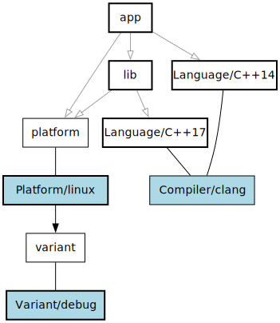
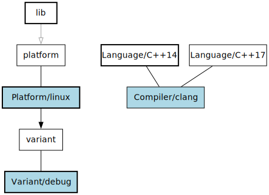

# Build::Dependency

Build::Dependency provides dependency resolution algorithms.

## Installation

Add this line to your application's Gemfile:

	gem 'build-dependency'

And then execute:

	$ bundle

Or install it yourself as:

	$ gem install build-dependency

## Usage

A dependency graph is a DAG (directed acyclic graph), such that if `A` depends on `B`, `A` has an edge pointing to `B`.

A dependency list is an ordered list of dependencies, such that if `A` depends on `B`, `B` will be listed earlier than `A`.

A dependency chain is the result of traversing the dependency graph from a given set of dependencies. It contains an ordered list of providers, a list of specific provisions.

A private dependency is not traversed when creating a partial chain. When building a partial chain for `app`, we don't follow `lib`'s private dependency on `Language/C++17`.

The orange box is the top level dependency, the grey box is an alias, the blue box is a specific provider, and the bold boxes are specific provisions which are being included.

### Model

To create your own dependency graph, you need to expose a model object which represents something that has dependencies and can be depended on.

## Contributing

1. Fork it
2. Create your feature branch (`git checkout -b my-new-feature`)
3. Commit your changes (`git commit -am 'Add some feature'`)
4. Push to the branch (`git push origin my-new-feature`)
5. Create new Pull Request

## License

Released under the MIT license.

Copyright, 2017, by [Samuel G. D. Williams](http://www.codeotaku.com/samuel-williams).

Permission is hereby granted, free of charge, to any person obtaining a copy
of this software and associated documentation files (the "Software"), to deal
in the Software without restriction, including without limitation the rights
to use, copy, modify, merge, publish, distribute, sublicense, and/or sell
copies of the Software, and to permit persons to whom the Software is
furnished to do so, subject to the following conditions:

The above copyright notice and this permission notice shall be included in
all copies or substantial portions of the Software.

THE SOFTWARE IS PROVIDED "AS IS", WITHOUT WARRANTY OF ANY KIND, EXPRESS OR
IMPLIED, INCLUDING BUT NOT LIMITED TO THE WARRANTIES OF MERCHANTABILITY,
FITNESS FOR A PARTICULAR PURPOSE AND NONINFRINGEMENT. IN NO EVENT SHALL THE
AUTHORS OR COPYRIGHT HOLDERS BE LIABLE FOR ANY CLAIM, DAMAGES OR OTHER
LIABILITY, WHETHER IN AN ACTION OF CONTRACT, TORT OR OTHERWISE, ARISING FROM,
OUT OF OR IN CONNECTION WITH THE SOFTWARE OR THE USE OR OTHER DEALINGS IN
THE SOFTWARE.
